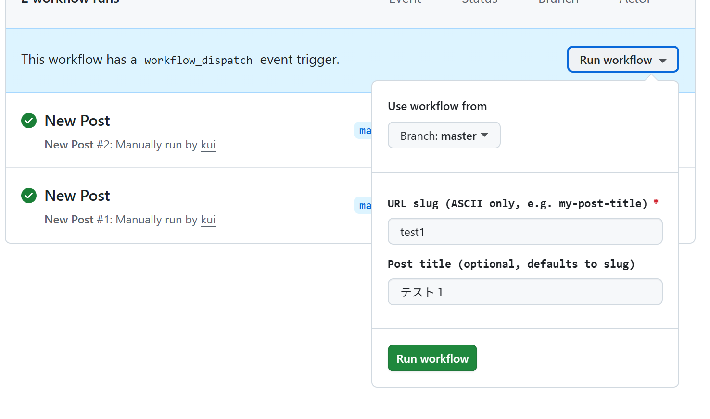
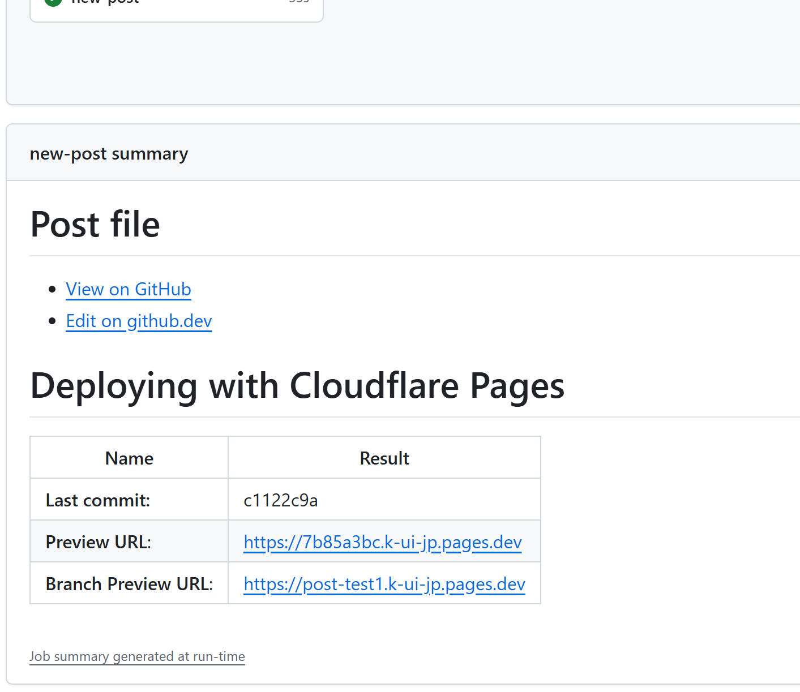

なんと10年ぶり。前回作り直しから数回の更新でまた作り直しで典型的なダメな無駄開発。一応反省はしていて、Markdownパーサを参照した自作サイトジェネレーターにした。長く使うならサイトジェネレーターとしての仕様は自分で管理したいので。

github もこの間にいろいろなことが変わって、静的サイトジェネレーターでも更新のしやすい仕組みがたくさん導入されている。それらを利用して更新までの工数を減らす工夫をした。これで更新頻度が上がらなかったらもうダメ。

新しいブログ投稿をするまでのフローは以下になる:

1. [new-post][] workflow で新しい投稿を作る
   
2. 完了するとエディタURLやプレビューURLが出てくる
   
3. "Edit on github.dev" でブラウザ上で VS Code が立ち上がる
4. 編集が終わったら commit & push
5. プレビューURLで確認
6. master merge で本番デプロイ

とりあえずこれで行ってみよう。

[new-post]: https://github.com/kui/k-ui.jp/actions/workflows/new-post.yml
